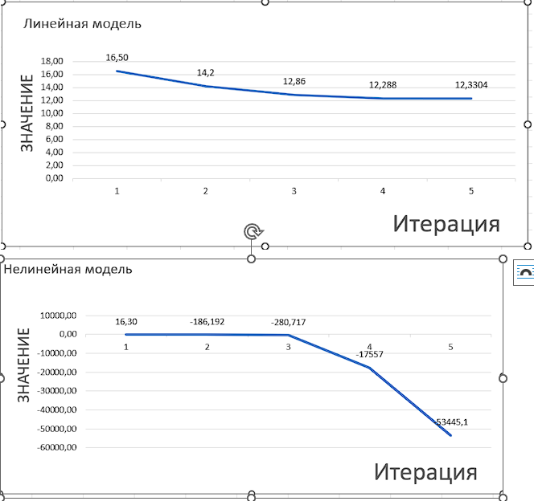

<p style="text-align: center;">Министерство образования Республики Беларусь</p>
<p style="text-align: center;">Учреждение образования</p>
<p style="text-align: center;">“Брестский Государственный технический университет”</p>
<p style="text-align: center;">Кафедра ИИТ</p>
<div style="margin-bottom: 10em;"></div>
<p style="text-align: center;">Лабораторная работа №1</p>
<p style="text-align: center;">По дисциплине “Общая теория интеллектуальных систем”</p>
<p style="text-align: center;">Тема: “Моделирования температуры объекта”</p>
<div style="margin-bottom: 10em;"></div>
<p style="text-align: right;">Выполнил:</p>
<p style="text-align: right;">Студент 2 курса</p>
<p style="text-align: right;">Группы ИИ-24</p>
<p style="text-align: right;">Капуза Н. А.</p>
<p style="text-align: right;">Проверил:</p>
<p style="text-align: right;">Иванюк Д. С.</p>
<div style="margin-bottom: 10em;"></div>
<p style="text-align: center;">Брест 2023</p>

---

# Общее задание #
1. Написать отчет по выполненной лабораторной работе №1 в .md формате (readme.md) и с помощью запроса на внесение изменений (**pull request**) разместить его в следующем каталоге: trunk\ii0xxyy\task_01\doc (где xx - номер группы, yy - номер студента, например **ii02102**).
2. Исходный код написанной программы разместить в каталоге: **trunk\ii0xxyy\task_01\src**.

## Task 1. Modeling controlled object ##
Let's get some object to be controlled. We want to control its temperature, which can be described by this differential equation:

$$\Large\frac{dy(\tau)}{d\tau}=\frac{u(\tau)}{C}+\frac{Y_0-y(\tau)}{RC} $$ (1)

where $\tau$ – time; $y(\tau)$ – input temperature; $u(\tau)$ – input warm; $Y_0$ – room temperature; $C,RC$ – some constants.

After transformation we get these linear (2) and nonlinear (3) models:

$$\Large y_{\tau+1}=ay_{\tau}+bu_{\tau}$$ (2)
$$\Large y_{\tau+1}=ay_{\tau}-by_{\tau-1}^2+cu_{\tau}+d\sin(u_{\tau-1})$$ (3)

where $\tau$ – time discrete moments ($1,2,3{\dots}n$); $a,b,c,d$ – some constants.

---

# Выполнение задания #

Код программы:
```cpp
#include <iostream>
#include <vector>
#include <cmath>

// Функция моделирования линейной модели
std::vector<double> linear_model(double a, double b, double y0, const std::vector<double>& u) {
    int n = u.size();
    std::vector<double> y(n + 1, 0.0);
    y[0] = y0;

    for (int r = 0; r < n; r++) {
        y[r + 1] = a * y[r] + b * u[r];
    }

    return std::vector<double>(y.begin() + 1, y.end());
}

// Функция моделирования нелинейной модели
std::vector<double> nonlinear_model(double a, double b, double c, double d, double y0, const std::vector<double>& u) {
    int n = u.size();
    std::vector<double> y(n + 1, 0.0);
    y[0] = y0;
    y[n] = y0;

    for (int r = 0; r < n; r++) {
        y[r + 1] = a * y[r] - b * std::pow(y[r - 1], 2) + c * u[r] + d * std::sin(u[r - 1]);
    }

    return std::vector<double>(y.begin() + 1, y.end());
}

int main() {
    double a = 0.8;
    double b = 0.5;
    double c = 0.3;
    double d = 0.2;
    double y0 = 20.0;
    std::vector<double> u = {1.0, 2.0, 3.0, 4.0, 5.0};  // входные значения тепла

    std::vector<double> result = linear_model(a, b, y0, u);
    std::vector<double> result1 = nonlinear_model(a, b, c, d, y0, u);

    // Вывод результатов для линейной модели
    for (double value : result) {
        std::cout << value << " ";
    }
    std::cout << std::endl;

    // Вывод результатов для нелинейной модели
    for (double value : result1) {
        std::cout << value << " ";
    }
    std::cout << std::endl;

    return 0;
}
**График:**




